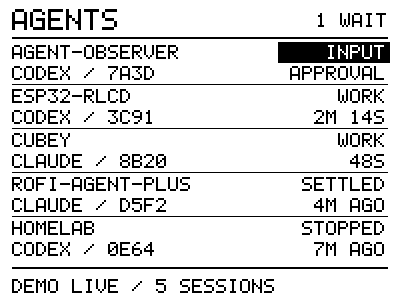
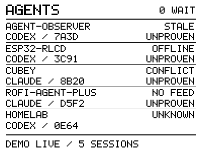
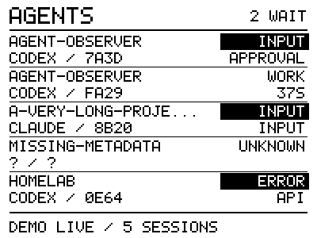
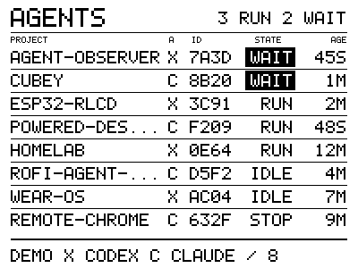
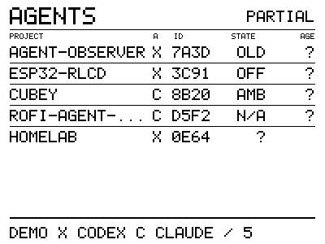
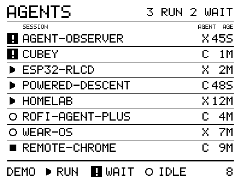
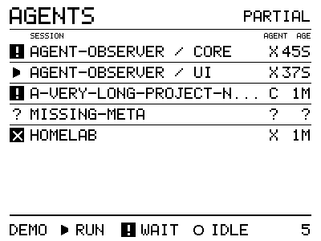
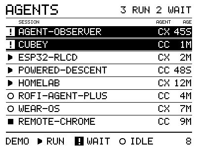
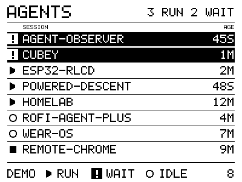
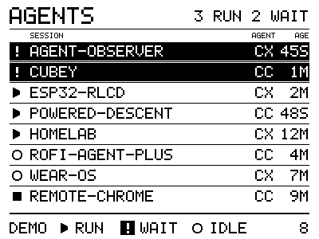

# Compact agent roster UI study

Date: 2026-10-02. Status: five-row layout accepted as readable and clean on the
physical panel; eight-row layouts are being refined on the board. The user
chose a compact roster of all sessions over a prominent single-session view,
then requested a denser layout with more information.

The 2026-10-03 [ordering and motion proof](ui-motion.md) extends the selected
eight-row layout. Its first prototype passed native checks, both firmware builds
and a complete on-board timing trace. The direction-based layering refinement
also passes native and on-board timing checks and has been accepted on the panel
for easier tracking of moving rows.
The measurements below describe earlier static layouts.

## Why this view

The full-color touch 349 already handles interactive system information and
notifications. The monochrome, non-touch RLCD can keep the coding-agent roster
visible without opening a picker. It should answer which sessions are working,
which need input, and whether the observation is trustworthy.

Agent Observer is being developed separately. This study explores presentation
using invented data; it does not choose provider sources or freeze its schema.
Current provider research and the data-source proof live in
[Agent Observer](https://github.com/byebyebryan/agent-observer).

## Five-row baseline

The [dashboard example](../examples/rlcd-dashboard/README.md) uses the existing
400 × 300 panel packing and queued full-frame transport. Its small C renderer
also produces native previews, avoiding a browser-only approximation of the
font, clipping or pixel geometry.

| Area | Presentation |
| --- | --- |
| Header | AGENTS and count of current input waits; source-health label replaces the count when the feed is stale/unavailable |
| Five 44-pixel rows | Project and state, then provider/short ID and a reason/age label |
| Waiting/error | White text in a solid black state rectangle; explicit INPUT or ERROR label |
| Uncertain row | STALE, OFFLINE, CONFLICT, NO FEED or UNKNOWN instead of an unproved current work state |
| Footer | DEMO, source health and visible total or an explicit overflow count |

Normal labels are WORK, INPUT, SETTLED, STOPPED and ERROR. SETTLED means the
observed response settled; it does not assert task success. All fixtures use
invented project identifiers and times. A short ID is a display hint, not an
identity key; real matching requires the full provider/host/native identity.

The renderer preserves supplied ordering. The fixture places input first to
test emphasis. Selection, wait-first prioritization, ordering stability,
overflow handling and refresh/freshness rules remain host-bridge decisions.
There is no automatic paging, scrolling, blinking or continuous animation in
this initial layout.

## Eight-row alternative

The second direction uses one 26-pixel line per session. Main text stays
14 pixels high, giving 60% more visible sessions by reducing repeated labels
and vertical spacing. Small column captions are seven pixels high; their
physical readability is a separate question from the main row text.

| Detail | Five-row baseline | Eight-row table |
| --- | --- | --- |
| Project | Up to 20 characters | Up to 14 characters |
| Provider | CODEX or CLAUDE | X or C, with footer legend |
| Short ID | Four characters | Four characters |
| Current state | WORK, INPUT, SETTLED, STOPPED, ERROR, UNKNOWN | RUN, WAIT, IDLE, STOP, ERR, ? |
| Extra information | Waiting reason or state-age example | State-age example in a fixed column |
| Header | Current input-wait count | Current running and input-wait counts |
| Uncertainty | Full row health labels | OLD, OFF, AMB, N/A; PARTIAL header suppresses misleading totals |

IDLE means the response settled, not that the task succeeded or a background
job completed. OLD is stale evidence, OFF is unavailable evidence, AMB is
conflicting evidence, and N/A is an unsupported source. Their age column is
unknown. AGE is a synthetic state-age example, not observer freshness: it
represents time in RUN/WAIT or time since IDLE/STOP/ERR. Real duration support
and the correct time origin remain to be proved by the data-source work.

The user liked eight rows but found name truncation annoying, and requested
less visible information: remove the ID, use icons for state, and consider a
smaller font. The next iteration follows that selection change first.

## Eight rows with state symbols

The third direction removes the visible short ID and replaces state words
with symbols. This increases name capacity from 14 to 24 characters while
keeping the main text at the already-readable 14-pixel height. The common
project names in the fixture now fit in full. Exceptionally long names still
truncate explicitly; this study does not claim unlimited title support.

| Symbol | Meaning |
| --- | --- |
| Filled right triangle | Working |
| White exclamation mark in a black square | Needs input |
| Hollow circle | Settled/idle; not task success |
| Filled square | Interrupted/stopped |
| White cross in a black square | Error |
| Clock | Stale observation |
| Horizontal dash | Unavailable observation |
| Question mark | Unknown work state or conflicting evidence |
| Slashed circle | Unsupported state source |

Each row has a state symbol, name, provider (X/C) and three-character state-age
example. The footer teaches RUN/WAIT/IDLE and retains DEMO and an explicit
overflow indication. Input subtypes and detailed source-health reason codes
are intentionally absent from this compact study, while the presentation
model retains their distinctions. Icon learnability needs physical feedback.

The identity stress case uses explicit invented labels `agent-observer / core`
and `agent-observer / ui`. Removing visible IDs must not merge sessions.
An eventual host bridge needs stable distinct display names for same-project
sessions, using explicit session names or another deliberate alias policy;
never reconstruct identity from the displayed name.

This symbol layout remains in the renderer and native comparison page. The
current firmware uses its attention/provider refinement described below.
A smaller/proportional font remains an option after checking whether the
regained name space resolves the issue. No presentation struct is a frozen
observer protocol.

The next design checkpoint is [urgency/age ordering and state-change motion](ui-ordering.md).
The user selected attention → idle/prompt → running, with oldest current-state
age first in every group. The ordering/motion design is documented; current
firmware still uses fixed fixture order and does not animate rows.

## Provider labels and attention proposal

The user confirmed the status symbols mostly work but found X/C ambiguous,
and asked about provider icons, CX/CC, removing the provider, and flashing
attention rows between normal and inverse colors.

Native-only comparisons now cover these choices:

| Variant | Name capacity | Attention treatment |
| --- | --- | --- |
| CX for Codex, CC for Claude Code | 23 characters | Normal row or persistent white text on black |
| No provider field | 26 characters | Persistent white text on black |

The main type remains 14 pixels high. Two-letter labels cost one character
relative to the current X/C layout, while omitting the provider gains three
characters relative to CX/CC. Simple provider symbols could fit the existing
14–18-pixel icon scale, but recognition is a design question; no provider-logo
assets have been added.

The attention treatment reverses the current waiting/error row's background
and text. The user requested keeping the status marks in their own polarity:
the waiting/error icons retain white marks on black. Stale/unavailable,
conflicting and unsupported observations do not inherit the attention style
from cached work state. The header still reports missing coverage explicitly.

Recommendation: retain CX/CC for useful provider context, keep a waiting/error
row persistently inverse, and consider only a brief slow pulse when a new
confirmed input wait begins. Continuous flashing is likely to distract during
coding. Any pulse should settle after a small bounded number of cycles, stop
when the wait resolves or loses trustworthy state evidence, and never restart
merely because the same snapshot is polled again. Timing and event identity
remain proposals; no pulse scheduler or live source has been implemented.

The user subsequently requested flashing the proposal. The firmware entrypoint
now selects CX/CC and steady inverse attention rows; that version was built and
flashed to the verified RLCD MAC `94:a9:90:f3:43:74`. It cycles the same seven
synthetic cases every 12 seconds. The no-provider variant remains a native-only
comparison. No pulse animation is implemented. The serial tool confirmed
startup roster/overflow writes with CX/CC and attention styling. The capture
process then terminated with host exit code 143, with cause unestablished;
this is partial startup evidence, not a complete stability run. Physical
readability feedback and a complete trace for this deployment remain pending.

The user then requested preserving white-on-black status-icon polarity.
The refined firmware reverses row text/background while leaving the status
marks unchanged. It was rebuilt and reflashed; a 14-second USB-reset startup
capture logged roster and overflow writes, one application start and no logged
errors. This is a startup check, not a complete seven-screen capture. Native
pixel comparisons confirmed five waiting/error symbols were identical with
and without highlighting. Physical acceptance of this refinement is pending.

## Synthetic previews

These 1-bit PNGs were generated from the same packed framebuffer renderer used
by the firmware. They are desktop previews, not photographs of the RLCD.

The generated local comparison page also includes overflow, whole-feed stale,
offline and empty cases. Regenerate with `./scripts/preview-dashboard.sh`.

## Evidence and limits

- Native C compilation with warnings as errors and ASan/UBSan passed for 42
  frames, including the new provider/attention comparisons; framebuffer guard
  bytes remained intact. Explicit checks confirm attention is suppressed after
  stale/unavailable/conflicting evidence and in empty cases. Three archived
  symbol-layout previews remain pixel-identical after the styled refactor.
- PNGs preserve exactly 400 × 300 pixels and one-bit grayscale, converted from
  the actual panel buffer.
- The ESP-IDF v5.5.3 dashboard firmware build passed.
- The original bring-up build and independent pixel-packing check passed.
- A 100-second capture of the five-row example logged all seven cases, nine
  frame writes, one application start and no logged errors. Drawing ranged
  from 1.473 ms (empty) to 6.655 ms (identity case); queued transfer ranged from
  12.154 to 12.203 ms. Free internal memory stayed at 353,747 bytes.
- The user reported the five-row layout was **"readable and clean"**, then
  asked for a denser direction. This accepts its observed text and screen
  completeness; it does not establish cold-boot recovery or live state accuracy.
- A second 100-second capture of the eight-row example logged all seven cases,
  nine frame writes, one application start and no logged errors. Drawing ranged
  from 1.667 to 6.428 ms; queued transfer ranged from 12.149 to 12.193 ms. Free
  internal memory again stayed at 353,747 bytes. The user liked the eight-row
  direction but requested fewer fields to address truncated names.
- The symbol layout's complete 100-second trace logged all seven cases, nine
  frame writes, one application start and no logged errors. Drawing ranged
  from 1.726 to 5.056 ms; queued transfer ranged from 12.153 to 12.205 ms. Free
  internal memory stayed at 353,747 bytes. Physical feedback on name space and
  symbol readability remains pending.

The five-row [serial log](evidence/2026-10-02-ui-study/serial.log),
[summary](evidence/2026-10-02-ui-study/summary.json),
[flash log](evidence/2026-10-02-ui-study/flash.log) and
[source/configuration/image hashes](evidence/2026-10-02-ui-study/images.json)
record the first deployment. The summary's physical-readability field records
its status at capture time; the subsequent user observation is documented here.

The eight-row [serial log](evidence/2026-10-02-ui-study/dense/serial.log),
[summary](evidence/2026-10-02-ui-study/dense/summary.json),
[flash log](evidence/2026-10-02-ui-study/dense/flash.log) and
[source/configuration/image hashes](evidence/2026-10-02-ui-study/dense/images.json)
record the second deployment. Both traces use synthetic session data.

The symbol layout's [serial log](evidence/2026-10-02-ui-study/icons/serial.log),
[summary](evidence/2026-10-02-ui-study/icons/summary.json),
[flash log](evidence/2026-10-02-ui-study/icons/flash.log) and
[source/configuration/image hashes](evidence/2026-10-02-ui-study/icons/images.json)
record the current deployment. Its first capture process terminated with host
exit code 143 before producing a complete artifact; the complete repeat is
the evidence above. The interruption's cause was not established and is not
treated as a passing run or as an established device fault.

The latest attention deployment has a
[verified flash log](evidence/2026-10-02-ui-study/attention/flash.log),
[source/configuration/image hashes](evidence/2026-10-02-ui-study/attention/images.json),
[startup stdout fragment](evidence/2026-10-02-ui-study/attention/startup-fragment.log)
and [partial-capture metadata](evidence/2026-10-02-ui-study/attention/startup.json).
Those startup records identify the selected attention layout; they do not
replace a full cycle or human readability acceptance.

The fixed-icon refinement has its own
[flash log](evidence/2026-10-02-ui-study/attention-fixed-icons/flash.log),
[startup trace](evidence/2026-10-02-ui-study/attention-fixed-icons/startup.log),
[startup summary](evidence/2026-10-02-ui-study/attention-fixed-icons/startup.json)
and [source/configuration/image hashes](evidence/2026-10-02-ui-study/attention-fixed-icons/images.json).

The earlier [drawing benchmark](performance.md) establishes headroom for that
workload; it is not a timing measurement of this UI. The static example logs
actual draw/transfer times when deployed and redraws only when changing synthetic
cases. The separate motion proof has its own scheduler, capture and complete
on-board timing trace and recorded physical acceptance of its refined animation.

## Questions for the next iteration

- Does the eight-row table improve on the readable five-row baseline at the
  actual viewing distance, or should spacing/type density change again?
- Should titles use project basename, an explicit session name, or a compact
  combination? Full project paths and transcript previews do not fit.
- How often do more than five relevant sessions exist? Decide a stable
  prioritization or paging policy from that workload; never hide waits silently.
- Which reason/age labels are supported by the eventual observer contract?
  Session age, work duration and observation freshness are different quantities.
- Is a compact source-age/heartbeat indication useful after live plumbing?
  It must not turn stale turn state into an apparently fresh observation.
- What font and bounded Unicode coverage should replace this uppercase study
  font? Unsupported bytes currently display question marks.

Firm typography, sorting, time semantics, buttons, host transport and live
integration remain open. Screen preview acceptance does not establish physical
panel acceptance or data-source correctness.
