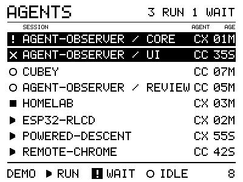

# Synthetic roster motion proof

Date: 2026-10-03. Status: the direction-layer refinement is flashed and measured.
Native checks, both firmware builds and a complete on-board trace pass. It uses
shared normalized row paths, upward motion in front and downward motion behind,
following physical feedback on the first prototype. The user accepted this
refinement on the panel: moving rows are easier to track. This is a local UI experiment with invented sessions,
not live Agent Observer integration.
See [the ordering decisions](ui-ordering.md) and [earlier layout evidence](ui-study.md).

The 2026-10-05 [urgency-band refinement](urgency-bands.md) adds compact working
rows, height-based visibility and eight further synthetic scenarios. Its current
loop is 92 seconds. The sequence and measurements below remain the historical
2026-10-03 evidence for the earlier fixed-height motion prototype.
The earlier [8px Fusion study](fusion-font-study.md) was superseded by the
selected [12px Fusion trial](fusion-12-font-study.md). The current
[header refinement](header-24-study.md) uses 24px summary text, 24/12-pixel
rows and a 264px body. [UI polish](ui-polish.md) records packed feed-loss targets.

## Prototype boundary

The experiment keeps eight visible rows, CX/CC provider labels, state symbols,
and steady inverse attention rows. Waiting/error symbols retain their original
white glyphs on black tiles. Full provider-qualified fixture identities stay
hidden; project names and short IDs do not identify moving rows.

The local model holds at most sixteen sessions. It sorts attention, idle,
running, then uncertain observations before selecting the visible eight.
Known state-entry times sort oldest first; unknown ages follow known ages.
Ties retain prior order, with stable admission order for new entries. State
entry and episode are explicit fixture facts. An observation or age tick does
not start a new episode.

Invalid snapshots, duplicate identities, future known entry times and capacity
overflow are rejected before mutation. Fixed tracks accommodate sixteen current
sessions plus bounded departing rows. Removed rows lose their cached work/age
claims while leaving. The model copies bounded strings into its own storage.

This C sorting model makes the display study self-contained. It does not move
display policy into Agent Observer or settle a future host-to-board protocol.
The planned live bridge still owns roster inclusion and presentation policy.
All fixture errors need intervention and all interrupted fixture sessions are
still available for a prompt; those assumptions are not provider discoveries.

## Movement and rendering

State, symbol, highlight and counts change immediately when an update is
accepted. Rows slide to new ordered slots over 360 ms with whole-pixel easing.
One shared eased progress value interpolates each row's own start and destination;
rows travelling different distances reach their endpoints together.
The firmware targets 25 frames per second during motion and updates ages once
per second at rest. Header and footer stay in place. Moving rows are opaque
and clipped to the roster viewport. Downward rows draw behind stationary rows,
and upward rows draw in front. Direction follows start/destination geometry and
stays fixed until an endpoint or retarget; input order stays stable within each tier.
Small gaps mark group boundaries without consuming rows for headings.

Updates are sampled at frame boundaries. A newer layout retargets from current
positions; obsolete transitions are not queued. Sustained layout churn has a
720 ms limit before snapping to the latest layout. The initial snapshot snaps.
There is no separate coalescing timer or flashing attention pulse in this proof.

Whole-feed loss cancels motion and freezes the current positions. Source
health replaces cached work indicators, counts and ages. Recovery accepts the
latest healthy snapshot. Overflow counts remain explicit and ordering happens
before the eight-row limit.

The SPI path stays at 10 MHz with queued full-frame writes. The UI task draws
only after the preceding transfer completes. No scan-rate, tearing or physical
smoothness claim follows from successful writes or native frame previews.

## Synthetic sequence

The loop lasts sixty seconds; each scenario lasts four seconds. The fixture
driver is polled continuously from elapsed zero. It does not reconstruct skipped
phases after a caller jumps several seconds ahead. Native previews replay the
same continuous timeline, and firmware polls every forty milliseconds.

| Seconds | Scenario |
| --- | --- |
| 0 | Initial eight-row urgency/age order, appearing directly |
| 4 | An answered wait enters the end of the running group |
| 8 | A prompt moves an idle session into running |
| 12 | A running session needs attention |
| 16 | A running session settles into idle |
| 20 | Two sessions change state together |
| 24 | Another update retargets the slide after 160 ms |
| 28 | Twelve sessions, with a new wait admitted before lower-priority rows |
| 32 | Distinct logical sessions in the same project |
| 36 | Whole-feed stale health cancels a slide after 160 ms |
| 40 | Healthy observation resumes |
| 44 | Whole-feed offline health cancels another slide after 160 ms |
| 48 | Observation resumes again |
| 52 | Ten attention sessions, with explicit overflow |
| 56 | Individual uncertain observations move into their own section |

## Run and inspect

Build and flash only the confirmed RLCD USB identity:

```sh
./scripts/idf.sh -C projects/agent-dashboard build
./scripts/idf.sh -C projects/agent-dashboard -p "$RLCD_PORT" flash monitor
```

The static seven-screen study remains selectable through `menuconfig` under
**RLCD dashboard study → Use the earlier seven-screen static layout study**.
Its original capture is `projects/agent-dashboard/scripts/capture-dashboard.py`; motion has a separate
capture command:

```sh
. scripts/env.sh
python3 projects/agent-dashboard/scripts/capture-dashboard-motion.py \
    --port "$RLCD_PORT" --seconds 95 \
    --reset --output projects/agent-dashboard/build/evidence/dashboard-motion-local
```

Use a new output directory and close any monitor first. The capture preserves
raw chunks as they arrive, writes a normalized serial log and JSON summary,
and requires a complete phase cycle, one application start, moving frames,
no logged errors and no logged frame-budget misses. Short or interrupted
captures remain partial evidence and return failure.

Firmware timing covers model update, draw and queued transfer through transfer
completion. Logging occurs afterward. Consecutive motion intervals are recorded
separately; this is a synthetic UI workload, not a general board benchmark.

## Validation status

The implementation loop used Luna for the controller, renderer, synthetic
fixture and native harness. The primary reviewed ordering/identity/motion
invariants, integrated the firmware scheduler and static fallback, added the
capture, and completed the firmware build and final checks.

- `./projects/agent-dashboard/scripts/test-dashboard-motion.sh` passes with ASan/UBSan and warnings as
  errors. It checks urgency/age order, stable ties and identity, atomic rejection,
  resets, repeated snapshots during motion, direction-layer compositing, shared
  progress across different distances, continuous retargeting, newest-target
  behavior, the burst bound, overflow, clipping, fixed icon polarity and feed loss.
  A twenty-four-track current/departing stress frame is rendered under sanitizers.
- The harness outputs twenty-six actual demo PBMs: initial, fifteen phase-settled
  frames and ten frames of an answered-wait slide. Regenerate PNGs and a local
  comparison page after the native test with:

  ```sh
  python3 projects/agent-dashboard/scripts/dashboard-preview.py \
      projects/agent-dashboard/build/native-motion
  ```
- All forty-two existing static PBMs remain byte-identical to the preserved
  baseline. The independent pixel-packing check passes for all 120,000 pixels.
- ESP-IDF v5.5.3 builds both the default motion mode and the static fallback.
  The refined embedded controller occupies 10,632 bytes of static storage according
  to the ELF symbol table; the native structure is 11,728 bytes. No dynamic model
  allocation or extra framebuffer is used for row compositing.
- The first flash attempt failed before writing while both ESP32 serial entries
  were absent. After reconnection, a fresh MAC check confirmed
  `94:a9:90:f3:43:74`; the image was flashed with verified data hashes.
- A twelve-second startup sample found four frames exceeding the forty-ms
  budget. Drawing took 26.058–28.484 ms, queued transfer 12.170–12.222 ms.
  This was a partial startup sample, not a complete-cycle pass.
- Rectangle filling now writes complete packed bytes and masks their edges.
  All 4,488 differential rectangle cases pass under ASan/UBSan; thirty-two motion
  and forty-two static PBMs remain byte-identical to the prior fill implementation.
- The optimized first prototype passed a 95.122-second on-board trace: all fifteen
  phases, one completed cycle, 300 frame writes (205 during movement), one
  application start, no logged errors and no frame-budget misses. Drawing ranged
  4.133–6.129 ms, transfer 12.168–12.211 ms, and complete frames 16.312–18.365 ms.
  Consecutive motion intervals were 39.998–40.002 ms. Free internal memory stayed
  at 343,227 bytes; the logged stack watermark stayed at 1,856.
- The user confirmed movement is worth keeping and requested the direction-based
  layering refinement below. That is design feedback, not final visual acceptance.
  SPI-write cadence does not measure panel scan rate or prove no tearing. The
  trace verifies one USB reset/start, not a physical cold-power boot.
- The user subsequently accepted the refined crossings on the panel:
  “much better, it makes it easier to track moving rows” and “already looking
  pretty good.” This accepts the current animation design at desk distance;
  it adds no optical scan-rate or tearing measurement.

## Implemented refinement after physical feedback

Use one normalized transition progress for every row, with each row's own starting
and destination positions. All rows reach their endpoints together. Retargeting
starts from the current interpolated positions and keeps the existing burst bound.

Draw rows moving downward first, stationary rows next, and rows moving upward last.
Direction comes from the transition's starting/destination geometry, independently
of work state. It stays fixed until the endpoint or a new target. This replaces
the first prototype's selected-row foreground rule. Native assertions cover all
three tiers, stable ordering within a tier, shared progress for different travel
distances, endpoint directions and retarget continuity. The initial frame and all
fifteen phase-settled frames remain byte-identical to the first prototype; crossing
frames change intentionally. All forty-two static study frames also match their
preserved baseline.

The refined firmware passed a new 95.121-second trace: all fifteen phases, one
completed cycle, 300 frame writes (205 moving), one application start, no logged
errors and zero forty-ms budget misses. Drawing took 4.110–6.142 ms, transfer
12.172–12.224 ms and complete frames 16.286–18.386 ms. Consecutive motion intervals
were 39.999–40.001 ms. Free internal memory stayed at 342,843 bytes; the logged
stack watermark stayed at 1,856. This is measured write timing for synthetic
scenarios. The user then confirmed on-device that the refined crossings make
moving rows easier to follow and accepted the current design.

The linked records are retained unchanged in the root evidence archive. Source
and image paths recorded inside those files describe the workspace layout at
capture time.

The initial [native/build summary](../../../docs/evidence/2026-10-03-ui-motion/summary.json),
[check record](../../../docs/evidence/2026-10-03-ui-motion/checks.log),
[source/configuration/image hashes](../../../docs/evidence/2026-10-03-ui-motion/images.json)
and [failed flash attempt](../../../docs/evidence/2026-10-03-ui-motion/flash-attempt.log)
record the initial disconnected-board boundary. The separate
[first startup](../../../docs/evidence/2026-10-03-ui-motion/first-startup/summary.json) records
the overruns. The optimized prototype's
[complete cycle](../../../docs/evidence/2026-10-03-ui-motion/packed-rect/summary.json),
[serial trace](../../../docs/evidence/2026-10-03-ui-motion/packed-rect/serial.log),
[verified flash](../../../docs/evidence/2026-10-03-ui-motion/packed-rect/flash.log),
[native checks](../../../docs/evidence/2026-10-03-ui-motion/packed-rect/native-checks.log) and
[source/configuration/image hashes](../../../docs/evidence/2026-10-03-ui-motion/packed-rect/images.json)
record the first measured deployment. The refined deployment has its own
[complete cycle](../../../docs/evidence/2026-10-03-ui-motion/direction-tiers/summary.json),
[serial trace](../../../docs/evidence/2026-10-03-ui-motion/direction-tiers/serial.log),
[verified flash](../../../docs/evidence/2026-10-03-ui-motion/direction-tiers/flash.log),
[native checks](../../../docs/evidence/2026-10-03-ui-motion/direction-tiers/native-checks.log) and
[source/configuration/image hashes](../../../docs/evidence/2026-10-03-ui-motion/direction-tiers/images.json).
Firmware images and the prior-image rollback copy remain in ignored build
directories; no commit or push has been made.




Opaque rows prevent superimposed text, but they temporarily cover fragments of
other rows during crossings. The native frames show this tradeoff; physical
feedback confirms that the shared paths and direction-based layering help
tracking at desk distance. Feed loss during a crossing freezes those current
poses until recovery, so a temporarily occluded label can remain occluded while
the source is unavailable. Health indicators, counts and ages stop asserting
cached work state during that interval.
